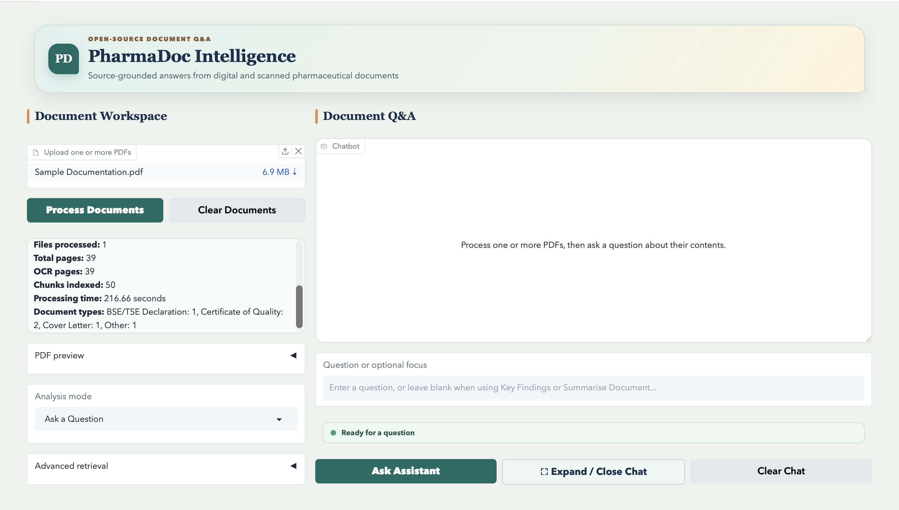
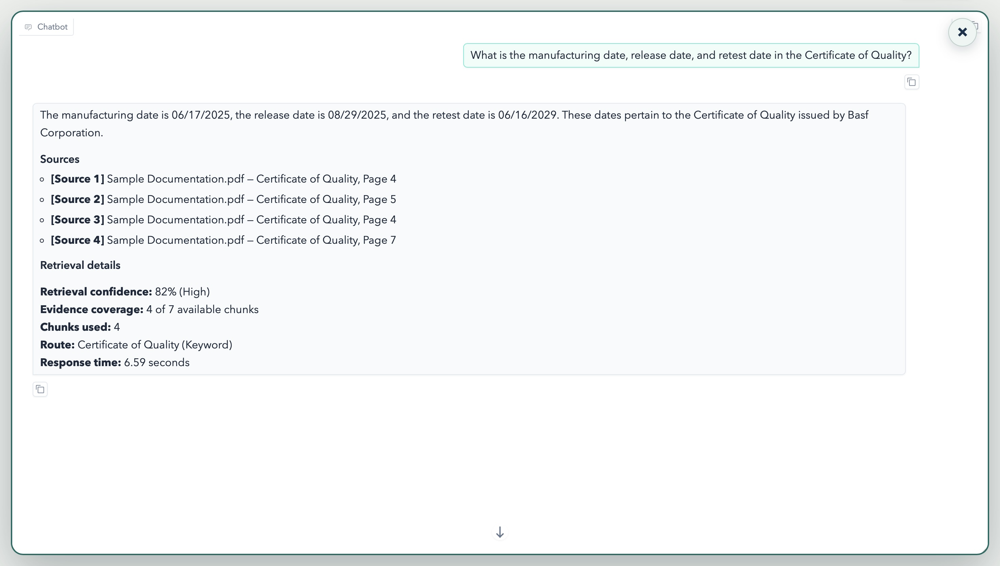

# PharmaDoc Intelligence

AI-powered pharmaceutical document intelligence system for extracting reliable, source-grounded information from digital and scanned PDFs.



## Overview

PharmaDoc Intelligence was developed as part of the Pfizer Advanced AI-Powered Document Insights and Data Extraction externship.

The system processes pharmaceutical PDFs, including scanned and rotated documents, and allows users to ask questions through an interactive Gradio interface. It combines OCR, document routing, semantic retrieval, and a local language model to produce answers with page-level source attribution.

## Problem

Pharmaceutical documentation can contain a mixture of:

- digital and scanned PDFs
- inconsistent layouts and tables
- rotated pages
- multiple document types
- regulated fields that require precise extraction

These characteristics make manual searching time-consuming and can reduce the reliability of basic text extraction workflows.

## Solution

The pipeline combines:

- direct PDF text extraction
- Tesseract OCR fallback for scanned documents
- orientation-aware OCR for rotated pages
- document classification and routing
- chunking with LlamaIndex SentenceSplitter
- MiniLM embeddings
- FAISS semantic retrieval
- grounded RAG prompting
- local Phi-3.5 answer generation
- page-level source attribution
- retrieval confidence and evidence reporting

## Architecture

```text
PDF Input
    ↓
Text Extraction / OCR
    ↓
Document Classification
    ↓
Chunking
    ↓
MiniLM Embeddings
    ↓
FAISS Vector Index
    ↓
Metadata-Aware Retrieval
    ↓
Grounded Prompt
    ↓
Phi-3.5
    ↓
Source-Grounded Answer
```

## Technical Stack

| Component | Technology |
|---|---|
| Language | Python |
| Environment | Google Colab |
| OCR | Tesseract |
| Chunking | LlamaIndex SentenceSplitter |
| Embeddings | all-MiniLM-L6-v2 |
| Vector Search | FAISS IndexFlatIP |
| Retrieval | Metadata-aware dense retrieval |
| LLM | Microsoft Phi-3.5-mini-instruct |
| Interface | Gradio |

### Key Configuration

- Chunk size: 500 characters
- Chunk overlap: 100 characters
- Top-K retrieval: up to 4 chunks
- Embeddings: normalised dense embeddings
- FAISS similarity: inner product
- LLM generation: deterministic, maximum 400 new tokens
- OCR orientation handling for rotated scans

## Evaluation

The final targeted test set produced:

- **100% hit rate**
- **100% answer accuracy across 4 targeted tests**
- **100% citation accuracy across targeted tests**
- retrieval confidence ranging from **58% to 82%**
- targeted response times between **2.41 and 6.59 seconds**
- average targeted response time of **4.31 seconds**

A 39-page scanned document required approximately **280 seconds** for OCR processing.

## Example Queries

The system successfully handled questions including:

> What is the manufacturing date, release date, and retest date in the Certificate of Quality?

It retrieved four relevant chunks and returned:

- Manufacturing date: 06/17/2025
- Release date: 08/29/2025
- Retest date: 06/16/2029



It also answered compliance questions such as:

> Does Kollidon SR contain any material of animal or human origin, and which BSE/TSE guidance does it meet?

The system correctly identified that the material contained no animal or human-origin material and referenced EMEA/410/01.

## Testing-Driven Improvement

During testing, OCR initially failed to extract the Process Run ID from a rotated dosimetry document.

The pipeline was updated with orientation-aware OCR, after which it correctly extracted:

`129708B`

This became one of the main testing-driven improvements in the final system.

## Limitations

Current limitations include:

- dense scanned tables can still be difficult to interpret during broad summarisation
- OCR quality depends on scan clarity
- document taxonomy remains relatively coarse
- local LLM generation can be slower for open-ended synthesis
- FAISS is currently in-memory rather than persistent

## Future Improvements

Potential improvements include:

- table and layout-aware extraction
- stronger summary validation
- evaluation of alternative embedding models
- more advanced learned reranking approaches
- persistent vector storage
- larger evaluation datasets
- monitoring and integration into regulated document workflows

## Skills Demonstrated

- Python
- Retrieval-Augmented Generation (RAG)
- OCR and document intelligence
- semantic retrieval
- FAISS vector search
- embeddings
- prompt engineering
- local LLM inference
- Gradio UI development
- testing and debugging
- evaluation
- technical documentation

## Project Files

- [View the full implementation notebook](PharmaDoc_Intelligence.ipynb)
- [View the final project presentation](Lola_Braut_Pfizer_Final_Presentation.pdf)

## Project Context

Built during the Pfizer Advanced AI-Powered Document Insights and Data Extraction externship.

This project demonstrates an end-to-end document intelligence workflow designed to turn unstructured pharmaceutical PDFs into traceable, source-grounded answers.
